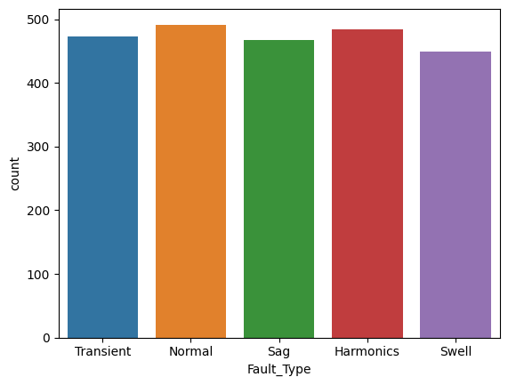
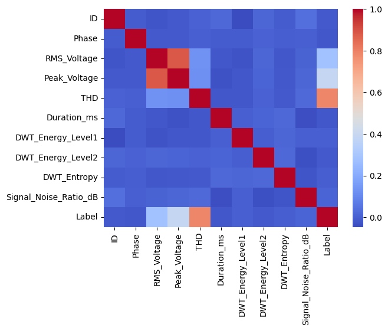
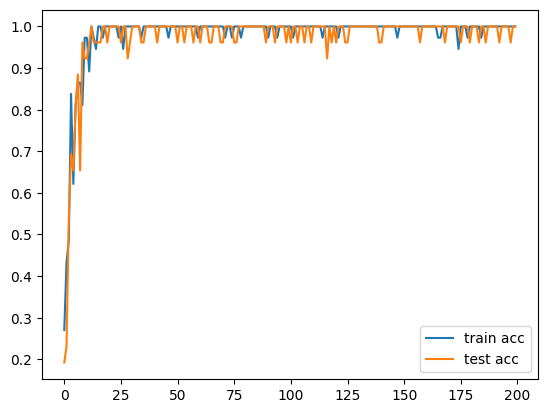
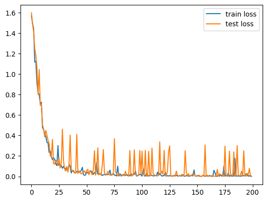
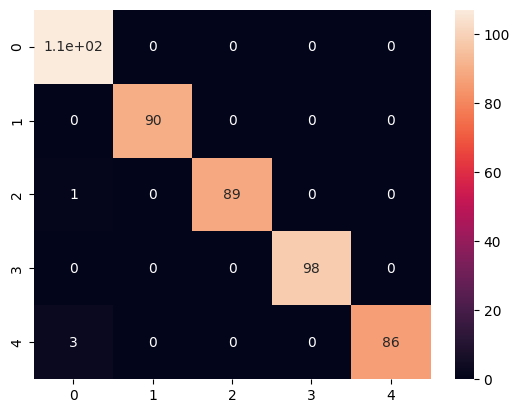

# Power Quality Fault Detection

A PyTorch-based machine learning project for **multiclass power quality fault detection** using engineered electrical features such as RMS voltage, THD, DWT energies, entropy, and signal-to-noise ratio.

## Project Overview

This project focuses on classifying power quality conditions into multiple fault categories using tabular signal-derived features.

The workflow includes:

- Downloading the dataset from Kaggle
- Exploring class balance and feature relationships
- Encoding categorical variables
- Training a PyTorch-based neural network classifier
- Evaluating model performance using training curves and a confusion matrix

This project demonstrates how feature-engineered electrical measurements can be used to automatically detect and classify power quality disturbances.

## Dataset

The notebook uses the Kaggle dataset:

**Power Quality Fault Detection Dataset**

The dataset is loaded from:

```python
power_quality_fault_dataset.csv
```

### Available features

The model uses the following input features:

- Phase
- RMS_Voltage
- Peak_Voltage
- THD
- Duration_ms
- DWT_Energy_Level1
- DWT_Energy_Level2
- DWT_Entropy
- Signal_Noise_Ratio_dB

### Target

The target column is:

- `Label`

The notebook works on a dataset with **2367 samples** and a multiclass target representing different power quality conditions.

## Data Exploration

### Class Distribution



### Feature Correlation Heatmap



These visualizations help understand dataset balance and relationships between the numerical electrical features.

## Model

The project is implemented in **PyTorch** using a neural-network-based classifier for tabular data.

Main libraries used:

- `torch`
- `torch.nn`
- `pandas`
- `numpy`
- `matplotlib`
- `seaborn`

The model learns from electrical quality indicators rather than raw waveform images, making this a clean feature-based fault classification study.

## Training

The notebook includes a full training workflow with:

- preprocessing and feature preparation,
- train-validation split,
- model training,
- loss and accuracy tracking,
- and final evaluation.

### Accuracy Curve



### Loss Curve



## Evaluation

### Confusion Matrix



The confusion matrix shows how well the model distinguishes between the different power quality fault classes.

### Results & Metrics

The model was trained for **200 epochs** on a 80/20 train-test split of the 2367-sample dataset.

**Final Performance:**

- **Test Accuracy:** 100% (achieved and sustained from ~Epoch 52 onward)
- **Training Accuracy:** Consistently 97.30%–100% in later epochs
- **Test Loss (final):** ~0.0013 (Epoch 199)

**Convergence summary:**

- Epoch 0: train acc 27.03%, test acc 19.23%
- Epoch 8: test acc reached 96.15% for the first time
- Epoch 33: model first hits 100% test accuracy
- Epoch 52 onward: test accuracy stable at 96.15%–100%

**Fault Classes (5-class classification):**
| Label | Fault Type |
|:---:|:---|
| 0 | Normal |
| 1 | Sag |
| 2 | Swell |
| 3 | Transient |
| 4 | Harmonics |

> The model converges cleanly on feature-engineered electrical measurements (RMS voltage, THD, DWT energies, entropy, SNR), demonstrating that tabular signal features are sufficient for reliable multiclass power quality fault detection without raw waveform processing.

## Repository Structure

```bash
power_quality_fault_detection/
│── 2.-power-quality-fault-detection.ipynb
│── README.md
│── requirements.txt
│── .gitignore
│── images/
│   ├── class_dist.png
│   ├── feature_heatmap.png
│   ├── loss.png
│   ├── accuracy.png
│   └── conf_matrix.png
```

## How to Run

1. Clone the repository.
2. Install the required dependencies:

```bash
pip install -r requirements.txt
```

3. Open the notebook:

```bash
jupyter notebook fault_detection.ipynb
```

4. Run all cells to:

- load and preprocess the data,
- train the neural network,
- visualize learning curves,
- and evaluate classification performance.

## Highlights

- Electrical-engineering-focused ML project
- Feature-based power quality disturbance classification
- PyTorch implementation for tabular multiclass classification
- Useful EDA with class distribution and correlation heatmap
- Clear evaluation with loss, accuracy, and confusion matrix

## Future Improvements

- Compare the neural network against classical models such as Random Forest, XGBoost, or SVM
- Perform hyperparameter tuning for better generalization
- Add model explainability using SHAP or feature importance analysis
- Extend the workflow to real-time monitoring or deployment scenarios
